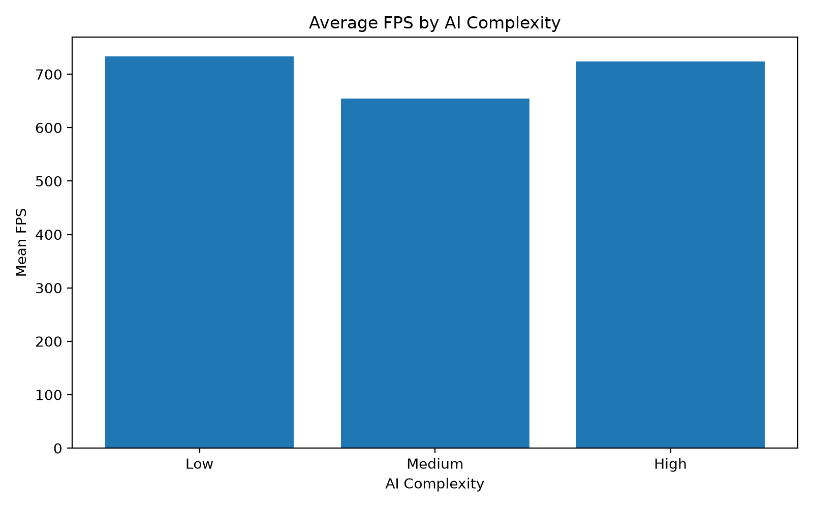
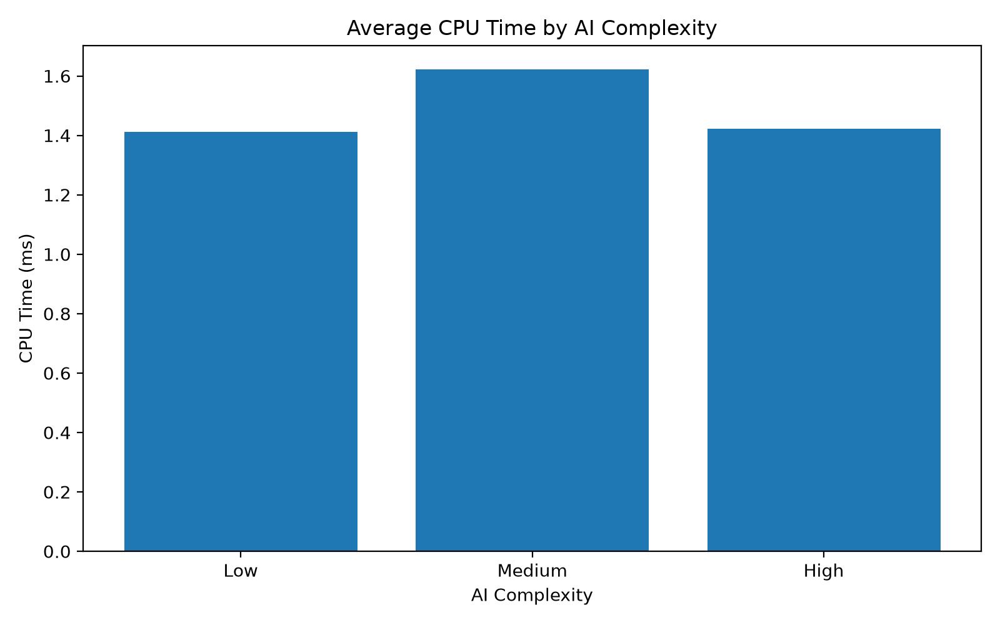
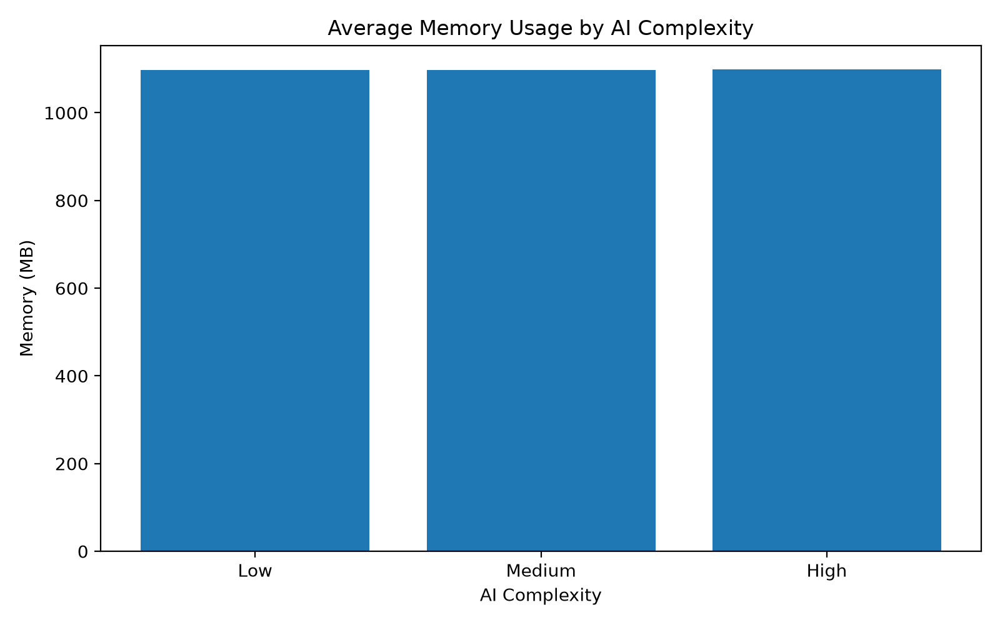
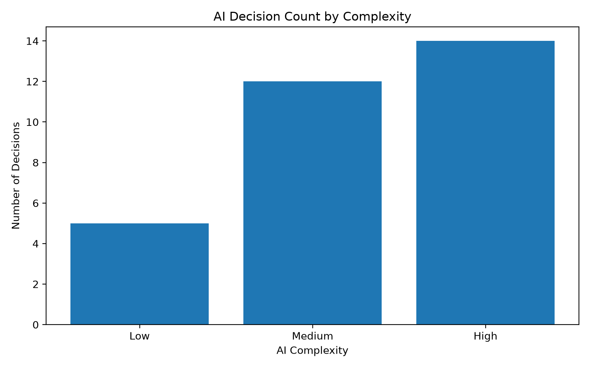
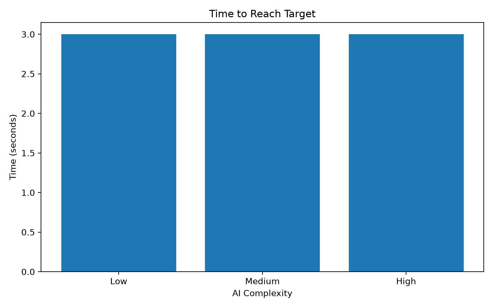

# Adaptive AI Agent Prototype

A small experimental prototype investigating how different levels of AI decision complexity affect runtime performance and behavioural outcomes in a Unity environment.

The project combines a Unity-based AI experiment with Python-based analysis of the collected performance measurements.

---

## Research Question

**How does increasing AI decision complexity affect computational performance and behavioural outcomes in a real-time Unity environment?**

The experiment compares three AI complexity levels:

- Low
- Medium
- High

The objective is to investigate the relationship between AI decision frequency, computational cost, and behavioural performance.

---

## Experiment Overview

The Unity environment contains an AI agent that navigates toward a target using different levels of decision-making complexity.

Each configuration was executed under the same experimental setup for approximately 30 seconds.

The experiment records:

- FPS
- CPU time per frame
- Memory usage
- Number of AI decisions
- Target-reaching behaviour

The collected measurements are exported as CSV files and analysed using Python.

---

## Experimental Conditions

| Configuration | Description |
|---|---|
| Low | Lower AI decision complexity and decision frequency |
| Medium | Intermediate AI decision complexity and decision frequency |
| High | Higher AI decision complexity and decision frequency |

The configurations primarily differ in how frequently the agent evaluates and updates its behaviour.

---

## Experimental Procedure

For each configuration:

1. The Unity experiment was started.
2. The agent was given the same target-oriented task.
3. Runtime performance was recorded.
4. AI decisions were counted.
5. Target-reaching behaviour was recorded.
6. Measurements were exported to CSV.
7. The datasets were analysed using Python.

The experimental datasets are:

- `low.csv`
- `medium.csv`
- `high.csv`

---

# Results

The measurements were analysed using Python.

| Complexity | Mean FPS | Min FPS | Max FPS | Mean CPU (ms) | Max CPU (ms) | Mean Memory (MB) | Final Decisions | Target Reached (s) |
|---|---:|---:|---:|---:|---:|---:|---:|---:|
| Low | 733.17 | 321.89 | 801.78 | 1.41 | 2.42 | 1097.41 | 5 | 3.0 |
| Medium | 653.99 | 342.75 | 809.18 | 1.62 | 3.32 | 1097.34 | 12 | 3.0 |
| High | 724.22 | 328.95 | 791.60 | 1.42 | 4.84 | 1098.62 | 14 | 3.0 |

### Decision Frequency

The number of AI decisions increased with complexity:

| Configuration | Decisions |
|---|---:|
| Low | 5 |
| Medium | 12 |
| High | 14 |

### Behavioural Outcome

The agent reached the target at approximately 3 seconds in all three configurations.

| Configuration | Target Reached |
|---|---:|
| Low | 3.0 s |
| Medium | 3.0 s |
| High | 3.0 s |

### Runtime Performance

Mean FPS was:

- Low: **733.17 FPS**
- Medium: **653.99 FPS**
- High: **724.22 FPS**

Medium complexity produced the lowest mean FPS in this experiment.

However, the results do not show a simple linear relationship between AI complexity and FPS.

### CPU Usage

Mean CPU time was:

- Low: **1.41 ms**
- Medium: **1.62 ms**
- High: **1.42 ms**

The highest observed CPU spike occurred in the High configuration at **4.84 ms**.

### Memory Usage

Mean memory usage remained relatively stable:

- Low: **1097.41 MB**
- Medium: **1097.34 MB**
- High: **1098.62 MB**

---

# Results Visualisation

The Python analysis generates comparison graphs for the main experimental measurements.

### FPS Comparison



### CPU Comparison



### Memory Comparison



### Decision Frequency Comparison



### Target-Reaching Comparison



---

# Interpretation

The experiment provides an initial indication of the relationship between AI decision frequency and runtime performance.

Increasing decision frequency from Low to High resulted in:

**5 decisions → 12 decisions → 14 decisions**

However, target-reaching time remained approximately **3 seconds** across all configurations.

Therefore, increasing decision frequency did not improve the measured target-reaching time in this experimental setup.

The runtime measurements also changed between configurations. Medium complexity produced the lowest mean FPS, while High complexity produced the largest observed CPU spike.

The results therefore suggest that increasing AI decision frequency does not necessarily provide a proportional behavioural improvement and may introduce additional computational cost.

These observations are specific to this prototype and experimental environment.

---

# Limitations

This prototype is an initial experimental investigation rather than a large-scale benchmark.

Limitations include:

- A single Unity environment was used.
- The experiment used one primary navigation task.
- The number of experimental runs was limited.
- Hardware and background system activity can affect measurements.
- Behavioural quality was represented primarily by target-reaching time.
- The environment does not currently contain complex multi-agent interactions.
- The AI task itself is relatively simple.

The results should therefore be considered preliminary observations rather than general conclusions about AI systems.

---

# Future Work

Future experiments could investigate:

- Multiple AI agents operating simultaneously.
- Larger and more complex environments.
- Dynamic targets.
- Changing environmental conditions.
- More detailed behavioural-quality metrics.
- Multiple independent trials.
- Statistical significance testing.
- Different AI decision-making algorithms.
- Adaptive decision-frequency mechanisms.

A particularly interesting extension would be an agent that dynamically changes its decision frequency according to environmental complexity.

For example:

```text
Stable environment
       ↓
Lower decision frequency
       ↓
Lower computational cost

Complex/changing environment
       ↓
Higher decision frequency
       ↓
More responsive behaviour
```

This would provide a stronger foundation for studying adaptive AI systems that balance behavioural responsiveness with computational efficiency.

## Python Analysis

Python is used to process the Unity-generated measurements and produce summary statistics and visualisations.

The analysis performs the following steps:

1. Loads the Low, Medium, and High CSV datasets.
2. Calculates summary statistics.
3. Combines the experimental results.
4. Compares FPS.
5. Compares CPU time.
6. Compares memory usage.
7. Compares AI decision frequency.
8. Compares target-reaching behaviour.
9. Saves processed results as CSV.
10. Generates comparison graphs as PNG files.

### Generated Files

The analysis produces:

* `summary.csv`
* `combined_results.csv`
* `mean_fps.png`
* `mean_cpu.png`
* `mean_memory.png`
* `decision_count.png`
* `target_reach_time.png`

---

# Project Structure

```text
Adaptive-AI-Agent-Prototype/
│
├── Assets/
│   └── Unity experiment files
│
├── Data/
│   ├── low.csv
│   ├── medium.csv
│   └── high.csv
│
├── Analysis/
│   ├── summary.csv
│   ├── combined_results.csv
│   ├── mean_fps.png
│   ├── mean_cpu.png
│   ├── mean_memory.png
│   ├── decision_count.png
│   └── target_reach_time.png
│
├── analysis.py
│
└── README.md
```

---

# Reproducibility

Clone the repository:

```bash
git clone https://github.com
```

Install the Python dependencies:

```bash
pip install pandas numpy matplotlib
```

Place the experimental CSV files in the Data directory:

```text
Data/
├── low.csv
├── medium.csv
└── high.csv
```

Run the analysis script:

```bash
python analysis.py
```

The processed CSV files and comparison graphs will be generated automatically.

---

# Technologies

* **Unity**
* **C#**
* **Python**
* **Pandas**
* **NumPy**
* **Matplotlib**

---

# Research Workflow

```text
AI Prototype
     ↓
Controlled Experiments
     ↓
Runtime Measurement
     ↓
CSV Data Collection
     ↓
Python Analysis
     ↓
Summary Statistics
     ↓
Visualisation
     ↓
Interpretation
     ↓
Future Research
```

The project demonstrates an experimental approach to evaluating AI systems beyond simple functional correctness by measuring both computational performance and behavioural outcomes.

---

# Research Context

This prototype forms an initial foundation for research into:

* Adaptive AI
* Real-time decision-making
* Computationally efficient intelligent systems
* Game AI
* Interactive environments
* AI performance optimisation

The longer-term research direction is to investigate AI agents that can balance decision quality and responsiveness against computational cost in real-time environments.

---

# Author

**Mehwish Asghar**  
B.S. Software Engineering  
GIFT University, Pakistan  

**Interests:**
* Artificial Intelligence
* Adaptive AI
* Real-Time Interactive Systems
* Game AI
* Human-Computer Interaction
* Efficient Software Engineering

---

# Repository

* **GitHub:** [https://github.com](https://github.com)
* **Portfolio:** [https://github.io](https://github.io)
